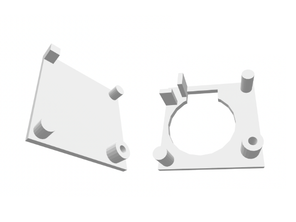
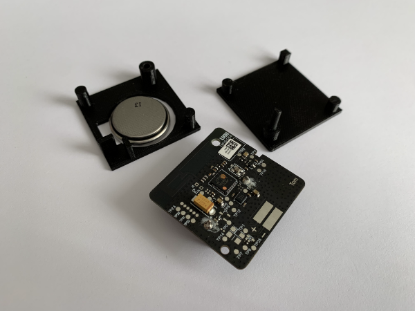

# wooden-zigbee-cube-controller.makefile

## Original Cube

Aqara Cube Zigbee controller, 45 x 45 x 45 mm.

## Tear Down

Important parts: circuit board and battery.

## New Case, Glued, Sanded

A wooden, 60 x 60 x 60 mm cube, e.g. a Soma cube, solved. Glued together to form two halves, then sanded.

## Hollowed Out, Fitted with Magnets

A 40 x 40 x 20 mm area milled out for the circuit board. In each corner, a 3 x 3 mm, cylindric magnet.

## Inlay Design

New 39 x 39 x 17 mm inlay to carry the circuit board: [top plate](wooden-zigbee-cube-controller-top-plate.stl) and [bottom plate](wooden-zigbee-cube-controller-bottom-plate.stl).

## Inlay Print

Inlay printed with PLA. And a 20 mm, headless M3 Nylon screw.

## Assembled Inlay

Inlay + circuit board + battery.

## Final Cube, Oiled

Fully assembled cube. Oiled surface.
