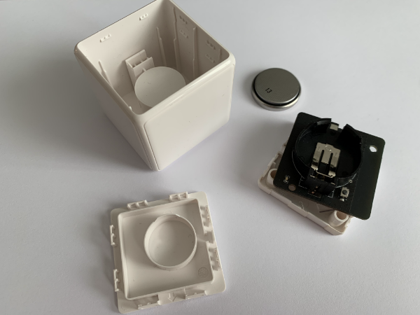

# wooden-zigbee-cube-controller.makefile

## Original Cube

## Tear Down

## New Case, Glued, Sanded

## Hollowed Out, Fitted with 3mm Magnets

## New Inlay

## Assembled Inlay

## Final Cube, Oiled

